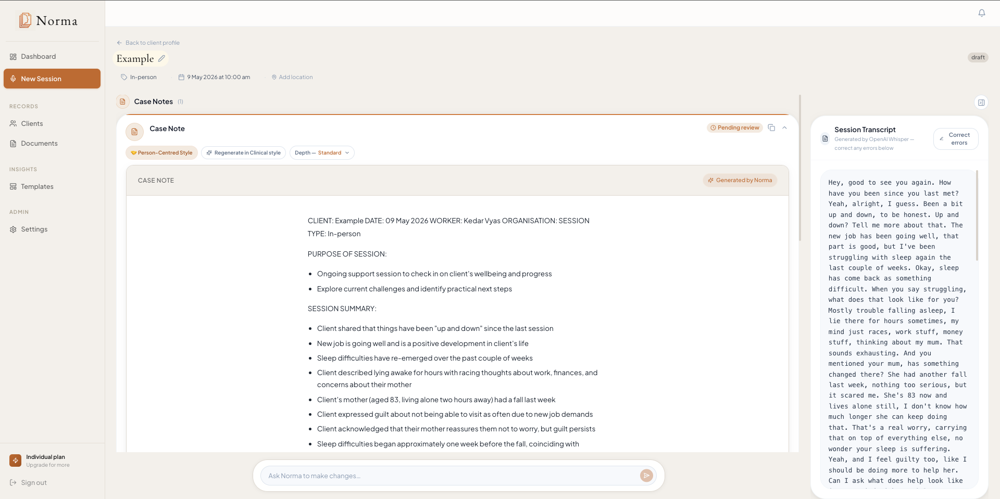

# Norma

Norma is an AI documentation tool for healthcare and community workers. It listens to your sessions, drafts your case notes in your own writing style, and gives you your evenings back.

## The problem

Healthcare and community workers spend large portions of their week on documentation. Necessary work, but it pulls focus from the work that actually matters — being present with clients, thinking through their situations, planning what comes next.

The hours add up. A 50-minute session generates 20-30 minutes of note writing afterwards. Across a full caseload, this is hours every day. Many workers do these notes after-hours because their day is full of sessions. The administrative load accumulates and contributes meaningfully to burnout across the sector.

Norma is built to change this. It listens to the session, generates the case note in the worker's own style, and gives the worker control to review, edit, and approve. A note that would have taken 30 minutes after the session takes 3 minutes during it.

## Who Norma serves

Healthcare and community workers who write case notes:

- Aged care workers and care coordinators
- Social workers in clinical and community settings
- Counsellors and therapists
- Case managers
- Allied health professionals
- Support workers

Existing AI documentation tools in the market are built almost exclusively for clinical contexts — therapists, psychologists, medical practitioners. Workers in community settings, support roles, and case management have largely been left out. Norma is designed to serve both clinical and non-clinical workers without forcing either into the other's mould.

## How it works

The worker starts a session. They hit record at the start of their meeting with a client.

Norma listens while they work. The worker focuses on the client, not on note-taking.

When the session ends, the worker stops the recording. Norma generates a draft case note based on the conversation.

### Notes that sound like the worker wrote them

This is where Norma differs from most AI scribes. Norma learns the worker's writing style over time — their vocabulary choices, how they structure their notes, whether they tend toward detail or brevity, how they discuss client strengths versus challenges. Each note the worker reviews and edits teaches Norma a little more about how they write.

The result is notes that genuinely feel like the worker's own work, not generic AI output. By the tenth session, Norma is writing in a way that matches the worker's natural voice. The worker spends less time editing because the draft is closer to what they would have written themselves.

This personalisation happens passively. The worker does not have to configure anything. They just use Norma normally and it adapts.

### Reviewing and editing

The worker reviews the draft. They can edit anything that needs adjustment.

They can also ask Norma to refine specific sections through a natural language input — "rewrite the summary in a more concise tone" or "expand the plan section with more detail" or "remove the bullet points and use paragraphs." Norma generates the revision, the worker reviews it, and accepts or discards. The worker stays in control of every change.

Workers can also set baseline preferences. Brief, Standard, or Detailed depth. Paragraphs or bullet points. Person-centred or clinical language. Direct quotes on or off. These preferences persist across sessions.

When the worker is satisfied, they approve the note. They copy it to their organisation's case management system.

### When recording is not appropriate

Not every session can or should be recorded. Some clients are not comfortable being recorded. Some contexts involve heightened sensitivity where audio capture would change the nature of the conversation. Some workers have organisational policies that limit recording.

Norma supports a post-session summary option for these situations. Instead of recording the session, the worker dictates a brief summary afterwards — what was discussed, what was decided, what comes next. Norma generates the case note from that summary using the same personalisation and language style settings.

Workers should never have to choose between client comfort and good documentation.

## Privacy and data

Care documentation contains sensitive client information. Norma is built with privacy as foundation, not as an afterthought.

**Audio is deleted immediately after transcription.** It is never stored. There is no audio archive of any session.

**Client session content is never used to train AI models.** Each worker's intelligence profile is built only from their own sessions and is never aggregated with other workers' data.

**Retention is configurable by the worker** between 24 hours and 30 days. After that, notes are automatically deleted. The worker can also delete any note manually at any time.

**Notes are not the system of record.** Norma is a drafting tool. Workers copy approved notes to their organisation's official case management system. Norma's 30-day maximum retention means client data does not accumulate in the tool over time.

## What I built

Norma is a working product with the core flow functional end-to-end. The current pilot scope includes:

- Real-time session recording with reliable transcription
- Post-session summary as an alternative when recording is not appropriate
- AI note generation in person-centred or clinical language
- Passive learning of each worker's writing style over time
- Ask Norma natural language editing for note refinements
- Worker-customisable depth, format, and quote handling
- Approval workflow that finalises notes
- Configurable data retention with worker control
- Privacy-first architecture

## Technical considerations

A few problems were harder than I expected and worth flagging:

**Transcription reliability.** Whisper hallucinates under certain audio conditions, particularly with leading silence. Catching this and preventing it from reaching the worker required several layers — detection of repeated phrases, prompt engineering that avoids giving Whisper material to echo, and silence handling before audio reaches the API. This is the kind of problem that does not appear in tutorials but matters enormously in production.

**Worker autonomy.** Documentation tools risk pulling decisions away from workers. Norma is deliberately designed to keep the worker in control — they decide what stays, what changes, what gets approved. The system does not auto-file or auto-approve. Workers remain professionally responsible for their documentation, which matters legally and ethically.

**Style learning without surveillance.** Building a system that learns how a worker writes without making them feel monitored required careful thought. Norma's learning happens passively and is invisible to the worker by design. There is no dashboard showing "how much Norma knows about you" because that would feel like surveillance. The intelligence exists to serve the worker, not to be displayed back to them.

**Built with Next.js, Supabase, and the Anthropic and OpenAI APIs.**

## Why I built this

I am a social worker. Over the past year of practice, I noticed something that has affected me and my colleagues: we were spending more time on documentation than with clients.

I stayed late a few times to finish notes. I watched experienced workers do the same. I thought about what we had been taught in university — nothing about how much administrative time this work would demand. I thought about what it meant for client outcomes when workers are mentally drained from documentation rather than energised to do good work.

The numbers across healthcare and community work tell the same story.

Healthcare clinicians spend an estimated 28 hours per week on administrative tasks. A JAMA study found physicians spend 36.2 minutes documenting in the EHR for every 30-minute office visit. Half of primary care physicians' total work time is spent on computer work outside of patient visits, with nearly half of that time on clerical and administrative work including documentation. The U.S. Surgeon General has named reducing administrative and documentation burden as a central recommendation for addressing healthcare worker burnout.

In community and human services, the situation is worse. Social workers report spending around 70% of their time on paperwork when proper tools are not in place. Lifetime burnout rates for social workers reach as high as 75%. A third of social workers in one survey directly cited paperwork, inefficient tools, and poor systems as primary reasons for burnout. Recent analysis suggests 64% of child welfare burnout is work-related rather than driven by the emotional weight of the work itself.

This is what I saw in myself and my colleagues. Workers entering these fields expecting demanding emotional work, finding instead that the documentation is what breaks them.

In late 2025 I started looking at the AI documentation tools coming to market. They were all for clinical settings — therapists, psychologists, medical practitioners. The community workers, support workers, case managers, and non-clinical practitioners who do similar volumes of documentation had been ignored.

I started building Norma to serve them too.

Norma is built from the community for the community. It is shaped by someone who does this work, for the people who do this work. The decisions about what Norma should and should not do come from inside the field, not from outside it.

## What I have learned

A few honest reflections.

**Prompt engineering matters far more than I expected.** The difference between a casual AI prompt and a production-quality AI prompt is enormous. Most of the engineering work in Norma is not in the application code — it is in the prompts that produce reliable, professional output across thousands of different real conversations.

**AI has reached a stage where someone with an idea can build it.** I do not come from a traditional engineering background. I came to this with a problem I wanted to solve and have used AI-assisted development to build the solution. This is genuinely new. It changes who can build software for specific domains. Norma exists because I understood the problem clearly and the tools made it possible to build the response.

**The hardest decisions are not technical.** Deciding what Norma should NOT do has been harder than deciding what it should do. Should it auto-approve notes if confidence is high enough? No — workers should approve everything. Should it retain notes indefinitely so workers can build a database? No — workers' organisational systems are the records, Norma is the drafting tool. The discipline of saying no to features that would technically work but would undermine the worker has shaped the product more than any single technical decision.

## Status

Built solo over recent months. Pilot launching soon with a small group of practitioners. Pre-revenue.

This repository is a public overview of the project. The application code is private.

## Sources

- Google Cloud/Harris Poll survey on clinician administrative time
- U.S. Surgeon General's Advisory on Building a Thriving Health Workforce (HHS.gov)
- JAMA study on physician documentation time per visit
- Northwoods social work burnout research
- Famcare research on administrative burden in human services
- Ohio State University College of Social Work analysis of child welfare workforce

## Contact

Built by Kedar Vyas. I would be glad to talk to anyone working at the intersection of AI and healthcare.

[email address]
